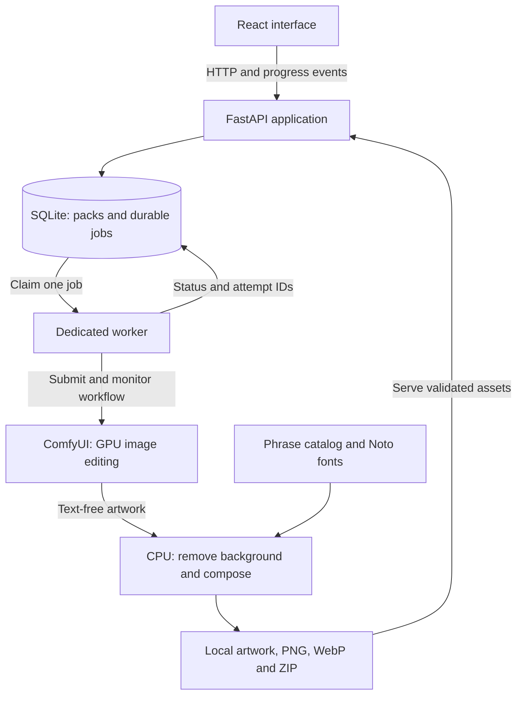
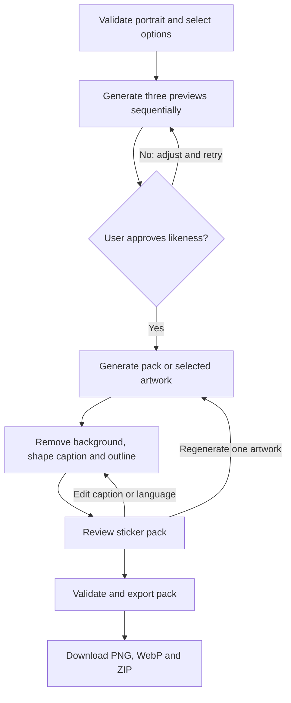

# StickerMe: local end-to-end build guide and master prompt

> Scope update, 3 October 2026: the implemented product is English-only. Telugu requirements below are historical and no longer apply. New packs generate twelve different cartoon expressions and hand gestures, with three-preview approval; cutout packs are legacy only. See [Build-Status.md](Build-Status.md) for the current implementation and real GPU evidence.

Prepared 2 October 2026. Target: Windows, NVIDIA RTX 4050 with approximately 6 GB VRAM. The configuration below assumes 16 GB system RAM or less; detect the actual amount before choosing the image workflow.

This is the original implementation specification and setup guide, retained for design context. The application and quantized GPU workflow have now been run on this laptop; current measurements and limitations are recorded in [Build-Status.md](Build-Status.md). The feasibility checks below explain the original decision gate, not an untested state of the current release.

## 1. What to build first

Build a local browser app that uploads one permitted photo, selects language and tone, produces three likeness previews, generates a 12-sticker pack sequentially, supports individual caption edits and regeneration, and exports transparent PNG/WebP files in a ZIP. Expand to 24 stickers once the 12-sticker workflow is reliable.

Use a pretrained image editor initially. No training dataset is required to launch this version. Save original artwork separately from captions so that language changes do not regenerate artwork.

Use the purple/lilac, white, rounded mobile-first design from the reference boards created in this conversation. Those images are design references, not functioning app screens. Save them from the conversation and attach them to the coding agent if you want closer visual matching.

## 2. Architecture

| Layer | Choice | Device |
|---|---|---|
| User interface | React, TypeScript, Vite, Tailwind CSS | Browser/CPU |
| App API | FastAPI, Pydantic, Python 3.12, uv | CPU |
| Persistent state | SQLite, SQLAlchemy, schema migrations | CPU/disk |
| Job execution | One dedicated worker with SQLite-backed jobs | CPU |
| Image generation | ComfyUI Portable, compatible GGUF loader, FLUX.2 Klein 4B distilled | GPU with offloading |
| Reference conditioning | Native image-editing reference input | Same image runtime |
| Caption selection | Reviewed JSON phrase catalog | CPU |
| Background removal | rembg with explicitly selected U2-NetP, ONNX Runtime CPU | CPU |
| Composition | Pillow with RAQM/font shaping support or a verified equivalent | CPU |
| Progress | Server-sent events, with reconnect and polling fallback | API/browser |
| Assets | Local folders, UUID filenames, versioned files | Disk |
| Export | ZIP plus platform-specific PNG/WebP outputs | CPU |

ComfyUI should be bound to localhost. The browser talks to FastAPI, not directly to ComfyUI. Use a built frontend during routine generation rather than keeping unnecessary development services running.

### System architecture



FastAPI owns user-facing state and downloads. SQLite stores job state; image files live on disk. The dedicated worker owns generation and finishing. ComfyUI loads the compatible Klein diffusion model, Qwen text encoder and FLUX.2 VAE, using offloading where the tested configuration supports it. The 6 GB GPU is reserved for one image task at a time; captions, background removal and export run on CPU. Model compatibility and memory fit remain benchmark gates.

### Sticker generation and editing pipeline



The artwork node handles either the initial 12-sticker sequential pack or one explicitly selected regeneration. Each generated sticker uses the original portrait reference. Caption edits reuse saved artwork and require no GPU generation. Save each successful result so an interrupted pack can resume.

## 3. Required downloads

Use official download pages for changing installer versions. Download individual model files, not every quantization in a repository.

| Download | Link | Instruction |
|---|---|---|
| Git for Windows | https://git-scm.com/download/win | Install Git and enable command-line access. |
| Node.js | https://nodejs.org/en/download | Choose supported LTS, Windows x64; the page currently lists Node 24 LTS. |
| uv | https://docs.astral.sh/uv/getting-started/installation/ | Install the Windows version. uv will install Python 3.12 for the backend. |
| ComfyUI Portable | https://docs.comfy.org/installation/comfyui_portable_windows | Use the NVIDIA package documented for modern RTX GPUs. |
| ComfyUI release files | https://github.com/Comfy-Org/ComfyUI/releases | Alternative official release listing. |
| 7-Zip | https://www.7-zip.org/ | Extract the portable archive if needed. |
| GGUF loader | https://github.com/city96/ComfyUI-GGUF | Install into ComfyUI/custom_nodes; pin the tested revision. |
| Official Klein workflows | https://docs.comfy.org/tutorials/flux/flux-2-klein | Start from the 4B distilled image-edit workflow. |
| Klein 4B quantized weights | https://huggingface.co/unsloth/FLUX.2-klein-4B-GGUF/tree/main | Choose flux-2-klein-4b-Q4_K_M.gguf; approximately 2.6 GB. |
| Matching encoder files | https://huggingface.co/Comfy-Org/vae-text-encorder-for-flux-klein-4b/tree/main/split_files/text_encoders | Compatible reference file: qwen_3_4b.safetensors, approximately 8.04 GB. Lower-memory candidate: qwen_3_4b_fp4_flux2.safetensors, approximately 3.85 GB, only after validating loader and RTX 4050 compatibility. |
| Matching VAE | https://huggingface.co/Comfy-Org/vae-text-encorder-for-flux-klein-4b/tree/main/split_files/vae | Download flux2-vae.safetensors, approximately 336 MB. |
| Quantized encoder alternative | https://huggingface.co/Qwen/Qwen3-4B-GGUF | Optional only when the chosen Klein workflow/loader explicitly supports the exact encoder and hidden-state extraction. Do not assume any chat GGUF is interchangeable with an image encoder. |
| GGUF example asset | https://huggingface.co/unsloth/FLUX.2-klein-4B-GGUF/tree/main/assets | A reference workflow asset; inspect it and validate image-edit support. |
| Noto fonts | https://fonts.google.com/noto | Download only the scripts you need: Latin, Telugu, Devanagari, Tamil. Preserve font license files. |
| Background-removal software/models | https://github.com/danielgatis/rembg | Install CPU extra and explicitly select u2netp. Do not inherit an unknown default checkpoint. |
| Pillow shaping documentation | https://pillow.readthedocs.io/en/stable/reference/features.html | Check RAQM and WebP at startup. |
| FastAPI documentation | https://fastapi.tiangolo.com/ | Backend documentation. |
| Vite documentation | https://vite.dev/guide/ | Frontend setup and supported Node versions. |
| PyTorch installer, if manually installing | https://pytorch.org/get-started/locally/ | Use its supported CUDA wheel selector; avoid replacing portable dependencies unnecessarily. |

The encoder/VAE repository name above is spelled `vae-text-encorder-for-flux-klein-4b` on the server. Keep the spelling when using URLs.

The FP4 encoder file is a candidate, not a guarantee that RTX 4050 can execute native FP4 kernels. Validate the current runtime's loading/dequantization path and memory use. If it cannot load correctly, use a supported quantized-encoder workflow or move to the smaller fallback; do not install random accelerator packages to force it.

The standard Klein workflow exceeds 6 GB VRAM in documented configurations. The Q4 file size excludes encoder, VAE, activations and runtime buffers. Assume sequential execution, offloading and a real benchmark are necessary.

## 4. Set up Windows in order

### Step 1: create separate folders

Suggested folders:

- C:\AI\ComfyUI_windows_portable
- C:\Projects\StickerMe

Keep the application backend environment separate from ComfyUI's embedded Python. Avoid spaces in these initial paths for simpler setup.

Check actual RAM in Task Manager > Performance > Memory. Aim to leave 30 GB or more of free SSD space for runtime, chosen weights, caches and outputs; this is a planning allowance, not a measured installation size. Do not download full training corpora yet.

### Step 2: install tools and Python

After installing Git, Node LTS and uv, open a fresh PowerShell terminal:

```powershell
git --version
node --version
npm --version
uv --version
uv python install 3.12
```

If `uv` is missing, complete its official Windows installation and reopen the terminal. Do not weaken PowerShell execution policy globally just to activate an environment: use `uv run`.

### Step 3: install and inspect ComfyUI

Extract the NVIDIA portable package. Run run_nvidia_gpu.bat. Open http://127.0.0.1:8188 after the terminal says the server is ready. Keep the terminal open.

From the portable folder, inspect its actual torch runtime:

```powershell
.\python_embeded\python.exe -c "import torch; print('Torch:', torch.__version__); print('CUDA available:', torch.cuda.is_available()); print('Torch CUDA:', torch.version.cuda); print('GPU:', torch.cuda.get_device_name(0) if torch.cuda.is_available() else 'none')"
```

Expected: CUDA available is True and the GPU is RTX 4050. The CUDA version shown by nvidia-smi is driver capability, not necessarily the toolkit or torch runtime installed. Use a runtime supported by the installed driver.

### Step 4: install the GGUF node

Stop ComfyUI and run these commands from the portable folder:

```powershell
git clone https://github.com/city96/ComfyUI-GGUF ComfyUI/custom_nodes/ComfyUI-GGUF
.\python_embeded\python.exe -s -m pip install -r .\ComfyUI\custom_nodes\ComfyUI-GGUF\requirements.txt
```

If the folder already exists, inspect/update that checkout instead of cloning a second copy. Restart ComfyUI and check its terminal for import failures.

### Step 5: place only matching files

| File | Destination relative to ComfyUI_windows_portable |
|---|---|
| flux-2-klein-4b-Q4_K_M.gguf | ComfyUI/models/unet/ |
| Selected compatible qwen_3_4b encoder | ComfyUI/models/text_encoders/ |
| flux2-vae.safetensors | ComfyUI/models/vae/ |
| Optional compatible LoRA later | ComfyUI/models/loras/ |

These paths follow the cited loader and native workflow conventions. If your tested version uses a different model folder, use its configured model-path mapping and record it. Do not rename mismatched weights to imitate supported files.

### Step 6: configure conservative runtime settings

Copy run_nvidia_gpu.bat to a separately named low-memory launcher. Check the installed version's CLI before adding flags:

```powershell
.\python_embeded\python.exe -s ComfyUI\main.py --help
```

If its help lists these flags, the following is a starting command:

```powershell
.\python_embeded\python.exe -s ComfyUI\main.py --windows-standalone-build --lowvram --reserve-vram 0.6
```

Keep the host bound to localhost. The 0.6 GB reserve is an initial setting, not an empirically validated requirement. Use the matching workflow's tiled VAE options, or CPU VAE only if supported and necessary. Do not force the entire pipeline onto cuda:0 or add highvram/gpu-only.

### Step 7: prove image editing works before integration

Load the official Klein 4B distilled image-edit workflow. Adapt the diffusion loader for GGUF and connect the exact supported encoder and VAE. If available, compare an author-provided quantized workflow against the official reference.

Start with one photo, one output, 512x512, batch one, four steps and the official distilled sampler/guidance settings. The official examples use larger resolutions; 512 is a proposed memory compromise and may reduce quality.

Example visual instruction:

```text
Create one clean cartoon sticker of the person in the reference photo.
Preserve recognizable face, hairstyle, facial hair, glasses if present,
skin tone and clothing. Friendly closed-mouth smile, giving a thumbs up.
Head and upper torso fully visible with generous padding. Bold clean
contours and simple colors. Plain solid background. No words, letters,
logos or additional people.
```

For generation, a solid simple background followed by explicit segmentation is more reliable than assuming a requested transparent background produces a true alpha channel.

Generate three reactions: thumbs up, laughter, surprise. Compare likeness, gestures, cropping and style. Record wall-clock duration, peak dedicated VRAM, system RAM and whether Windows is paging heavily. Repeat a three-image run to measure warm behavior; do not mistake cache reuse for fresh generation speed.

If memory fails: keep batch one, remove extra references, reduce resolution, confirm offloading and a supported low-memory encoder, try documented VAE options. If unacceptable swapping or failures persist, use the smaller fallback. An SSD pagefile is not GPU VRAM.

Export the working graph in **ComfyUI API format**, not just frontend graph format. Save an immutable workflow plus a separate explicit node/input binding map. Save ComfyUI and GGUF revisions and model hashes.

### Step 8: initialize the app environment

From C:\Projects\StickerMe, the coding agent can create the project. Example backend setup inside its backend directory:

```powershell
uv init --python 3.12
uv add fastapi "uvicorn[standard]" pydantic-settings sqlalchemy alembic python-multipart httpx pillow "rembg[cpu,cli]" psutil
uv add --dev pytest
uv run python -c "from PIL import features; print('RAQM:', features.check_feature('raqm')); print('WebP:', features.check_module('webp'))"
```

Use a verified Windows text-shaping renderer if RAQM is unavailable; native-script export must not silently fall back to unshaped glyphs. First run of background removal may download its selected checkpoint; provide an explicit setup/download step so offline runs do not unexpectedly fail.

Frontend example in the app root:

```powershell
npm create vite@latest frontend -- --template react-ts
```

The coding agent should then add current compatible Tailwind and chosen UI dependencies according to their current documentation, and commit lockfiles. Do not force old Tailwind initialization commands into a newer major release.

### Step 9: implement the backend and persistent worker

Implement upload validation and orientation handling; bounded references; pack/sticker/job tables; reviewed reaction and phrase catalog; preview gate; generation adapter; CPU finishing; validated export. Have one worker claim jobs atomically with a lease. Reconcile jobs with ComfyUI history after a restart before resubmitting. Save completed stickers individually.

Use ComfyUI's documented /upload/image, /prompt, /ws, /history/{prompt_id}, /view, /object_info and /system_stats endpoints. GET /object_info is the authority for installed nodes; do not invent node names. Map a particular workflow's fields explicitly. Reference uploads go through ComfyUI's upload route before the graph uses their names.

Cancellation must affect only an app-owned job. Avoid global queue clearing. If using /interrupt, first verify that the running job belongs to this application. Store task IDs and attempt IDs for reconciliation.

### Step 10: implement six complete product screens

Home/my packs; photo upload; language/style/tone selection; three-preview approval; pack editor; export. Include loading, empty, error, reconnect and partial-completion states. Make the interface mobile-first with a useful desktop layout.

Initial supported language seed: English plus Telugu. Hindi and Tamil may be added when corresponding phrases and fonts are reviewed. If generated example translations are included, mark them unreviewed and allow editing; never advertise verified native phrasing without review. Script choices should depend on the selected language.

### Step 11: finish and export correctly

Remove background on CPU, crop foreground without cutting off gestures, fit inside a transparent 512x512 canvas, apply outline, reserve caption space, shape and wrap text, then encode. Validate actual alpha values rather than accepting a checkerboard picture as transparency.

Deliver ZIP with original text-free artwork, finished PNG, platform-specific WebP, a pack cover, metadata and a short import guide. Re-encode to satisfy each platform's size profile, and fail clearly when a readable compliant output cannot be made.

WhatsApp and Telegram have separate pack-installation routes. A web ZIP is not automatic installation. For the first release label the actions Download ZIP and View import instructions. A later Telegram publishing integration needs account/bot configuration and authorization. A later WhatsApp companion uses an actual supported native integration. Do not show enabled Add to WhatsApp/Add to Telegram buttons that only download files.

### Step 12: validate the full workflow

First acceptance target: one photo, three sequential previews, approve appearance, 12 completed stickers, edit one caption without GPU work, regenerate one sticker, restart/resume safely, create ZIP and inspect every exported asset. Expand to 24 after this passes.

Record an actual performance report rather than promising instant packs. Test duplicate requests, worker restart, lost WebSocket connection, model-not-installed, memory errors, deletion during jobs and cancellation. Test caption bounds and visual glyph shaping with the real fonts; inspect native-script screenshots manually.

## 5. Training data: optional, not a runtime requirement

| Resource | Official download/access link | Suitable role | Restriction |
|---|---|---|---|
| Cartoon Set 10k/100k | https://google.github.io/cartoonset/download.html | Cartoon attributes/style experiments | CC BY 4.0; not paired real-photo likeness data. 10k archive listed as 450 MB, 100k as 4.45 GB. |
| BPCC | https://huggingface.co/datasets/ai4bharat/BPCC | Translation adaptation later | Gated. Subset-specific CC0/CC BY licenses; do not assume one blanket license. Prefer relevant human-created everyday data. |
| IN22-Conv | https://huggingface.co/datasets/ai4bharat/IN22-Conv | Conversational translation evaluation | Keep held out from training; listed CC BY 4.0. |
| StickerConv | https://huggingface.co/datasets/NEUDM/StickerConv | Conversation-to-reaction research | Text data available; underlying sticker images are excluded and require separate SER30K access. |
| SER30K | https://github.com/nku-shengzheliu/SER30K | Sticker emotion classifier research | Academic access application; not an unrestricted commercial image source. |
| FFHQ | https://github.com/NVlabs/ffhq-dataset | Portrait-generation research | Noncommercial dataset; authors exclude facial-recognition development. |
| CelebA | https://mmlab.ie.cuhk.edu.hk/projects/CelebA.html | Face-attribute/editing research | Noncommercial research; identity annotations have an access process. |
| AffectNet | https://mohammadmahoor.com/pages/databases/affectnet/ | Expression recognition research | Research-only release/access process. |
| RAF-DB | https://www.whdeng.cn/RAF/model1.html | Expression recognition research | Noncommercial research access. |
| VSD2M | https://arxiv.org/abs/2412.08259 | Relevant sticker-generation paper | Linked project still labels data/code Released Later; not a confirmed downloadable training dependency. |

Do not download these all at once. None of these is a verified complete photo-to-personal-sticker-to-localized-caption training solution. Your strongest eventual data is original, rights-cleared paired photos and sticker illustrations plus native-speaker-reviewed short phrases.

Suggested visual manifest fields: person_id, reference_paths, target_artwork_path, expression, intensity, gesture, style_id, foreground_mask_path, source/license, consent_id, review_status and split. Keep subjects disjoint across train/validation/test; keep text out of visual targets if captions are a separate renderer. Do not take production uploads as training consent.

Phrase manifest fields: phrase_id, intent_id, language, script, region, tone, audience, text, romanized_text, source/license, reviewer and review_status. Typography tests are distinct from linguistic review.

For later Klein LoRA work use the official guide: https://huggingface.co/blog/black-forest-labs/flux-2-klein-lora . Its described 4B training route uses a 24 GB class GPU; do not plan standard training on this 6 GB laptop. Test adapter compatibility with the distilled quantized inference engine afterward. Optional smaller local experiments: https://huggingface.co/docs/diffusers/training/lora .

## 6. Master prompt for a coding agent

Copy everything inside the following block into Codex, Cursor or another coding agent with access to your intended project folder. The prompt authorizes building and testing the local app; deployments, paid services and account-based sticker publication are separate actions.

```text
Build StickerMe, a complete local personalized sticker-pack app for Windows.
Implement it in the current project workspace and work through the stages below.
Produce runnable code, setup scripts, tests, real integrations and documentation.

Hardware and scope
- Target NVIDIA RTX 4050, approximately 6 GB dedicated VRAM, and 16 GB system RAM
  or less. Detect actual hardware on this computer; do not assume you have access
  to the user's GPU if you are executing in a remote container.
- Use pretrained inference first. No training data or paid cloud service is
  required for version one. Runtime network use is limited to explicit setup
  downloads; keep user-photo generation local.
- Run one GPU image job at a time, batch size one, initial 512x512, three previews
  generated sequentially, 12-sticker pack with optional 24 after validation.
- Primary candidate: FLUX.2 Klein 4B DISTILLED Q4_K_M GGUF in ComfyUI. Use four
  steps and the matching official distilled sampler/guidance defaults.
- Standard Klein configurations exceed this GPU's capacity. Validate quantized
  model, compatible Qwen3-4B encoder, FLUX.2 VAE, offloading, and actual memory.
- Quantization file size is not total runtime memory. Detect unavailable models,
  unsupported loader/encoder combinations, OOM and excessive paging clearly.
- Provide an engine interface that can support a separately verified smaller
  SD 1.5/IP-Adapter workflow. Do not claim fallback inference is implemented
  until there is a real compatible workflow and smoke test.
- Provide useful photo-cutout mode when image generation is not configured,
  labeled clearly; it must not masquerade as newly generated facial expressions.

Technology
- React + TypeScript + Vite + current compatible Tailwind for the frontend.
- FastAPI + Pydantic + Python 3.12 + uv for the app service.
- SQLite + SQLAlchemy + migrations and a persistent single-worker job queue.
- ComfyUI Portable is a separate process and Python environment on localhost.
- CPU-only ONNX/rembg with explicitly selected u2netp for background removal.
- Pillow with working RAQM and script fonts, or a verified Windows text-shaping
  alternative, for composition. Check WebP support.
- Serve a built frontend from the app for ordinary use; developer mode may use
  Vite separately. Keep all app paths configurable with Windows-safe Path APIs.
- Use compatible current stable versions and lockfiles, and record tested
  ComfyUI/custom-node revisions. Do not blindly upgrade portable torch.

Product behavior and design
- Match the supplied purple/lilac, white rounded mobile reference boards when
  present. Use polished mobile-first layouts, readable typography and a desktop
  arrangement. Implement accessible labels, focus states and clear errors.
- Screens: home/my packs, photo upload, language/style/tone selection, likeness
  preview/approval, pack editor, export/download. Include every loading, empty,
  partial, interrupted, offline-engine and error state needed for these flows.
- Validate file signatures, supported formats, byte/pixel limits, EXIF rotation
  and obvious unusable photo quality. Use UUID filenames and bounded references.
- Ask the uploader to confirm permission to use the person's image. Packs are
  private locally. Delete pack assets and derived references on request; training
  collection requires separate opt-in and is outside this first release.
- Start with one cartoon style. Offer only styles that actually have generation
  instructions or supported adapters. Do not expose a fictitious likeness slider.
- Start with English and Telugu, with reviewed phrase data when available.
  Structure language catalogs so Hindi and Tamil can be added. Clearly mark any
  automatically drafted phrases unreviewed. Permit custom caption editing.
- Provide native-script and Romanized options only where applicable. Handle
  Unicode normalization, grapheme-safe wrapping, font fallback and text bounds.
- Use 24 distinct intent templates, covering greetings, agreement, refusal,
  laughter, surprise, thanks, apology, sadness, affection, waiting and busyness;
  pick 12 for the first pack. Each has expression/gesture and phrase metadata.
- Use original reference photo for every generated sticker. Optionally add an
  approved appearance reference only after verifying quality and memory. Do not
  create a chain of edited previous stickers. A common seed is not an identity
  guarantee. Preserve model/workflow/version/seed and reference hashes.
- Generate visual artwork without captions, then remove background and add
  caption/outline on CPU. A caption or language change must never trigger GPU
  generation unless the user explicitly regenerates artwork.

ComfyUI adapter
- Inspect the installed /object_info, /models and /system_stats APIs. Start from
  the official 4B distilled image-edit workflow and validate node schemas.
- Save a frontend workflow for human inspection and an API-format workflow for
  execution, plus explicit configurable mappings for reference, prompt, seed,
  dimensions, models and output nodes. Never invent node IDs or loader enums.
- Upload reference images using /upload/image; submit via /prompt; monitor /ws
  with /history/{prompt_id} polling fallback; fetch outputs through /view.
- Implement timeouts, reconnection, structured errors and execution ownership.
  Store prompt_id and attempt_id. Reconcile history before retry after restart.
- Only interrupt the application's own running job. Never clear a shared global
  queue or cancel another person's ComfyUI work.
- Cache completed results by input/workflow/model/style/reaction/seed version.
  Store prompt/reference inputs so regenerations are reproducible.

Persistence and APIs
- Tables: packs, references, stickers, jobs, job_attempts, phrase_catalog and
  model/workflow configuration. Use durable job states with timestamps and leases.
- Implement health/engine diagnostics, upload reference, create/get/list/delete
  packs, preview generation, approve appearance, generate pack, get job/events,
  cancel/resume, regenerate sticker, edit caption, remove/reorder sticker, and
  download ZIP/individual files. Specify API schemas in OpenAPI and README.
- Claim jobs atomically. Avoid resubmitting completed or still-running ComfyUI
  work after app restart. Use atomic file writes and safe output containment.
- Deletion must handle active jobs without recreating removed pack assets.
- Keep one dedicated worker; do not treat FastAPI BackgroundTasks as a durable
  queue. Prevent duplicate generations from double clicks/idempotent retries.

Finishing and export
- Preserve text-free originals. Remove background with true alpha; checkerboard
  pixels are not transparency. Crop foreground, fit it into padded canvas, apply
  outline, reserve caption space, shape text and create PNG/WebP.
- Validate actual dimensions, alpha, clipping, duplicates and file sizes. Show
  light/dark chat previews. Offer single-sticker regeneration and removal.
- Produce ZIP with original artwork, finished PNG, platform-specific WebP,
  pack cover, manifest and import instructions. No path traversal or unsafe ZIP
  filenames. Failed exports must explain the concrete reason.
- Keep platform profiles configurable and verify current official requirements.
  Initial static WhatsApp profile: 512x512, <=100 KB each, <=30 per pack;
  Telegram import profile: transparent PNG/WebP, one side 512, <=512 KB.
- ZIP export does not equal sticker installation. Initially implement Download
  ZIP and View import instructions. Only enable direct install/publish buttons
  after a real supported integration is configured and tested on a target device.

Suggested project layout
- frontend/, backend/app/{api,db,services,worker,engines}/, workflows/, scripts/,
  data/phrases/, assets/fonts/, tests/, docs/, .env.example and README.md.
- Keep runtime uploads/outputs/database/model weights out of git. Preserve
  upstream font licenses and record each model/source/license in a manifest.
- Include system-architecture and generation-pipeline Mermaid diagrams in docs.
- Add setup.ps1, start.ps1, stop.ps1, doctor and benchmark commands. Scripts
  must not overwrite unrelated files, change global execution policy, auto-install
  GPU drivers, kill unrelated processes or expose local inference publicly.

Build stages and evidence
1. Inspect existing files and environment; preserve unrelated user work. Produce
   a concrete implementation plan, then implement without stopping at the plan.
2. Implement the hardware/model/font diagnostics and a real single-image
   ComfyUI edit smoke test. Record actual measurements when the GPU is available.
3. Build persistence, worker and finishing/export; verify them on fixture images.
4. Build all product screens and connect real API flows. A development fake
   engine is allowed for tests but must be visibly labeled and disabled as a
   production substitute for generation.
5. Test upload -> three previews -> approval -> 12 stickers -> caption edit ->
   individual regeneration -> resume -> ZIP. Expand to 24 only after this works.
6. Add meaningful tests for jobs/restart/idempotency, cancellation ownership,
   path containment, caption overflow, alpha and export limits. Use mocked engines
   for integration tests and a separate real-GPU smoke test. Inspect native-script
   rendering visually; Unicode support alone is not a shaping test.
7. Run backend tests, frontend typecheck/build and appropriate browser flow
   checks. Produce a benchmark report, installed versions and Windows commands.

If the current environment lacks the target GPU, complete all independent code
and CPU/mock checks, provide a Windows smoke-test command and explicitly identify
the unverified GPU integration. Do not fabricate latency, likeness approval,
hardware compatibility, trained weights, successful tests or working downloads.
Document any remaining blocker with the exact diagnostic and next action.

Reference links
- https://docs.comfy.org/installation/comfyui_portable_windows
- https://docs.comfy.org/tutorials/flux/flux-2-klein
- https://github.com/city96/ComfyUI-GGUF
- https://huggingface.co/unsloth/FLUX.2-klein-4B-GGUF/tree/main
- https://huggingface.co/Comfy-Org/vae-text-encorder-for-flux-klein-4b/tree/main/split_files
- https://docs.comfy.org/development/comfyui-server/comms_routes
- https://github.com/danielgatis/rembg
- https://pillow.readthedocs.io/en/stable/reference/features.html
- https://fonts.google.com/noto
- https://github.com/WhatsApp/stickers
- https://core.telegram.org/import-stickers

Do not train a large foundation model as part of this build. Keep later dataset
curation and optional fine-tuning separate from the functioning local app.
```

## 7. How to use the master prompt

Open your intended local repository in a coding agent, attach this file and the UI reference boards, and paste the master prompt. Keep the agent in the same project until the stages are complete. If model weights are not present, let it finish independent backend/frontend work and the diagnostics, then perform the manual download and hardware check.

At each stage ask for a runnable result and actual validation evidence. A page of plausible screens is not sufficient: acceptance includes real photo input, sequential generation, correct text shaping, resumption and downloadable validated files. Distinguish clearly between CPU/mock testing and a real laptop GPU test.

Suggested follow-up if the agent produces only a mockup:

```text
Continue implementing the remaining master-prompt stages in this repository.
Connect the real persistent worker and ComfyUI API adapter. Run all available
tests and list the exact remaining target-hardware checks. Keep simulated
generation explicitly labeled; do not report it as real inference.
```

## 8. Later upgrades

After measured local success: expand pack size, add reviewed languages and themes, improve segmentation, evaluate a compatible style/edit LoRA, and implement one real mobile import integration. If 16 GB RAM causes severe offloading pressure, investigate whether this laptop supports a RAM upgrade; it will not enlarge GPU VRAM. Public multi-user hosting needs a separate deployment and GPU-capacity plan.

## 9. Source notes

Download names and sizes were checked against the current upstream model repositories. Software download pages can change; prefer the linked official release pages and lock the versions that pass the smoke test. Primary source references for platform/export behavior: https://faq.whatsapp.com/1056840314992666 , https://github.com/WhatsApp/stickers and https://core.telegram.org/import-stickers . Dataset license details: the official entries in section 5 and https://github.com/AI4Bharat/IndicTrans2 . Model/training references: https://huggingface.co/black-forest-labs/FLUX.2-klein-4B and https://huggingface.co/blog/black-forest-labs/flux-2-klein-lora . Driver/runtime explanation: https://docs.nvidia.com/datacenter/tesla/drivers/latest/cuda-toolkit-driver-and-architecture-matrix.html .
