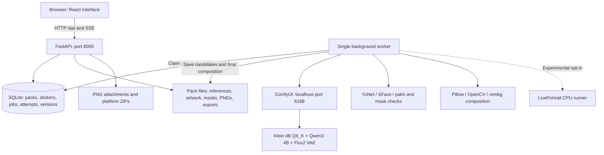
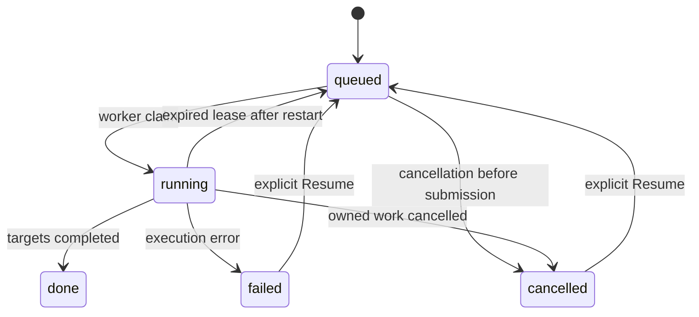

# StickerMe — Architecture and Complete Implementation Guide

Documented: **4 October 2026**. Project: `D:\Additional Project\Img_2_Sticker`.

Free cloud demo: **[https://stickerme-free.vercel.app/](https://stickerme-free.vercel.app/)**. This demo uses the official
public Hugging Face Klein Space for generation and keeps packs in browser storage.
GPU queues and quotas apply. See [free cloud deployment](Docs/free-cloud-deployment.md)
for its features, limits and build settings. The architecture below describes the
full local application.

This document describes the implemented application, its generation pipelines, the fixes applied after visual review, and the steps to install, operate, validate and extend it. The implementation uses local inference with **FLUX.2 Klein 4B Q6_K**. It does not train or fine-tune a model. Training proposals remain in [Docs/plan2.md](Docs/plan2.md), and the training comparison remains in [Docs/plan3.md](Docs/plan3.md).

The current defaults in the source code take precedence over older build notes. In particular, automatic photographic face animation is now disabled, PNG downloads do not require quality approval, and flagged stickers can be explicitly accepted by the person reviewing them.

## Contents

1. [What is implemented](#1-what-is-implemented)
2. [System architecture](#2-system-architecture)
3. [Folder and module responsibilities](#3-folder-and-module-responsibilities)
4. [Installation, startup and restart](#4-installation-startup-and-restart)
5. [Model and workflow configuration](#5-model-and-workflow-configuration)
6. [Database and stored artifacts](#6-database-and-stored-artifacts)
7. [Upload and reference preparation](#7-upload-and-reference-preparation)
8. [Photographic generation step by step](#8-photographic-generation-step-by-step)
9. [Cartoon generation step by step](#9-cartoon-generation-step-by-step)
10. [Transparency, border and caption composition](#10-transparency-border-and-caption-composition)
11. [Quality checks and human review](#11-quality-checks-and-human-review)
12. [Corrections, masks and version recovery](#12-corrections-masks-and-version-recovery)
13. [Worker, engine recovery and cancellation](#13-worker-engine-recovery-and-cancellation)
14. [Frontend flow and progress updates](#14-frontend-flow-and-progress-updates)
15. [PNG downloads and platform exports](#15-png-downloads-and-platform-exports)
16. [API reference](#16-api-reference)
17. [Configuration reference](#17-configuration-reference)
18. [Implementation sequence](#18-implementation-sequence)
19. [Validation and recorded evidence](#19-validation-and-recorded-evidence)
20. [Troubleshooting and maintenance](#20-troubleshooting-and-maintenance)
21. [Remaining improvements](#21-remaining-improvements)

## 1. What is implemented

A person uploads one portrait they have permission to use, selects a style and tone, and receives twelve separately generated reactions. Each reaction has its own artwork, caption, seed, revision and quality report.

| Feature | Current implementation |
|---|---|
| Generation | Local ComfyUI with FLUX.2 Klein 4B Q6_K; no hosted inference API |
| Photographic styles | Realistic and Likeness; expression and pose generated together by default |
| Drawn styles | Cartoon, Chibi and Comic; two character designs before reaction generation |
| Tone | Playful, Warm or Dramatic |
| Initial preview | Greeting, Laughter and Surprise |
| Full pack | Remaining nine reactions queued after the three previews are reviewed and approved |
| Captions | English; editable or removable without new diffusion generation |
| Output | Transparent 512 × 512 PNG per reaction |
| Corrections | New candidate, closer face resemblance, better hands/gesture or clearer expression |
| Review | Separate identity, expression, style, framing, anatomy, mask and variety findings |
| Flag handling | Explicit human acceptance of a flagged current revision, with detector findings retained |
| Version history | Immutable saved PNG versions and metadata; compare and restore |
| PNG saving | Download available saved PNGs as a ZIP or save an individual PNG, regardless of review status |
| Platform export | Reviewed pack ZIP with WhatsApp/Telegram formats, artwork and provenance |
| Recovery | Durable jobs, leases, stored engine attempts, explicit Resume for uncertain submissions |
| Training | Planned separately; no training dataset, trainer or trained adapter is integrated |

The internal `mode="cartoon"` identifies the generated-reaction system, including Realistic and Likeness. It does not mean every output is drawn. Older `photo_cutout` packs use a retained compatibility path that repeats the same cutout with different captions.

Exact resemblance, correct fingers and a perfect expression are still visual acceptance goals. A successful job, a high face score or a valid PNG does not establish those goals.

## 2. System architecture



There are three main processes:

1. **API process:** validates requests, serves the built frontend, stores user decisions and produces downloads. It does not run the diffusion model inside request handlers.
2. **Worker process:** executes one durable job at a time, asks the engine for candidates, evaluates them and saves the selected result.
3. **Generation engine:** ComfyUI runs the pinned workflows and model weights in its separate CUDA Python environment.

The application environment is `.venv`. The generation environment is `runtime/engine-env`. Keeping them separate allows the API and image-processing dependencies to coexist with the engine's pinned CUDA stack.

The API binds to `127.0.0.1:8000`; the managed engine binds to `127.0.0.1:8188`. API middleware rejects nonlocal clients and untrusted browser origins. The engine adapter also restricts its configured URL to localhost. Model setup needs network access; ordinary inference uses the installed local models.

## 3. Folder and module responsibilities

| Path | Responsibility |
|---|---|
| `backend/app/main.py` | FastAPI lifecycle, API routes, review/edit guards, image serving and downloads |
| `backend/app/config.py` | Project/data paths, feature flags and screening thresholds |
| `backend/app/db.py` | SQLAlchemy models, SQLite connection settings and sessions |
| `backend/app/migrations.py` | Additive schema upgrades preserving existing records |
| `backend/app/catalog.py` | Twelve intents, captions, gestures, styles, tones and generation prompts |
| `backend/app/comfy.py` | Workflow binding, reference upload, durable submissions, queue/history recovery and output retrieval |
| `backend/app/worker.py` | Job claim/heartbeat, design/preview/pack/correction generation and result persistence |
| `backend/app/imaging.py` | Upload normalization, reference preparation, segmentation, alpha cleanup, composition and encoders |
| `backend/app/likeness.py` | YuNet/SFace embeddings, reference recovery and advisory cosine comparison |
| `backend/app/quality.py` | Framing, palm, identity, mask and variety screening |
| `backend/app/portrait.py` | Optional LivePortrait orchestration, source/driver crops and guarded face composition |
| `backend/app/corrections.py` | Alignment and regional correction for supported paths |
| `backend/app/versions.py` | Saved revision snapshots and restorable fields |
| `backend/app/provenance.py` | SHA-256 of actual installed workflow model files |
| `backend/app/cleanup.py` | Removal of owned ComfyUI inputs and attempt outputs |
| `frontend/src/App.tsx` | Upload/settings, pack navigation, progress, design selection, editor, mask UI and export |
| `frontend/src/StickerReview.tsx` | Quality panel, explicit review, correction controls and version comparison |
| `frontend/src/style.css` | Application appearance, previews, cards and dialogs |
| `frontend/vite.config.ts` | React/Tailwind setup and development `/api` proxy |
| `workflows/` | Pose/face graphs, bindings, model manifests and engine dependency pins |
| `scripts/services.py` | Verified owned-process launch, status and shutdown |
| `scripts/doctor.py` | Readiness and environment diagnostics |
| `scripts/download_*.py` | Engine, face-detector and LivePortrait asset installation |
| `scripts/liveportrait_runner.py` | One-shot or resident CPU face-animation process |
| `scripts/validate_*.py` | Isolated staged generation and photographic-route QA |
| `scripts/benchmark_plan1_*.py` | Saved-input expression and segmentation comparisons |
| `scripts/repair_*.py` | Explicit repairs of affected saved composites/transparency |
| `tests/` | Workflow, persistence, recovery, quality, editing, review and export regression checks |
| `Docs/` | Original plans, implementation history and defect-specific records |
| `.tools/` | Local tooling and session-specific restart/inspection helpers |
| `runtime/` | Default database, pack assets, installed engine, models, logs and validation artifacts |

Dependency declarations live in `pyproject.toml` and `frontend/package.json`. Exact application resolutions are recorded in `uv.lock` and `frontend/package-lock.json`. Engine dependencies are separately listed in `workflows/engine-requirements.txt`.

## 4. Installation, startup and restart

### 4.1 Required local components

The implemented target is Windows with Python 3.12, Node/npm, Git for pinned engine installation, and a CUDA-capable NVIDIA GPU. The current project was developed with an RTX 4050 laptop GPU with 6 GB VRAM. Quantization and offloading make inference possible on that machine; they do not establish that full model training will fit.

The project setup installs an isolated Python 3.12 using `uv` when needed. It does not require changing Miniconda base.

### 4.2 Initial setup or dependency repair — PowerShell

Run from the project root:

```powershell
Set-Location "D:\Additional Project\Img_2_Sticker"
powershell.exe -NoProfile -ExecutionPolicy Bypass -File .\setup.ps1 -DownloadModel
powershell.exe -NoProfile -ExecutionPolicy Bypass -File .\setup_engine.ps1
```

The first script:

1. Locates or installs project-local `uv` and Python 3.12.
2. Runs the locked application dependency installation.
3. Installs frontend dependencies with `npm ci` and builds `frontend/dist`.
4. With `-DownloadModel`, installs U2-NetP, face models and LivePortrait assets.
5. Runs diagnostics.

The engine script:

1. Installs ComfyUI and ComfyUI-GGUF at the pinned commits.
2. Refuses to replace modified tracked engine source when switching revisions.
3. Creates `runtime/engine-env`.
4. Installs the pinned CUDA PyTorch stack and engine requirements.
5. Checks that CUDA is available.
6. Downloads and verifies model files, unless `-SkipDownloads` was specified.

The setup script still installs LivePortrait assets with `-DownloadModel`. The default photographic runtime does not require animation to be enabled.

### 4.3 Normal startup when the API is stopped

PowerShell:

```powershell
Set-Location "D:\Additional Project\Img_2_Sticker"
powershell.exe -NoProfile -ExecutionPolicy Bypass -File .\start.ps1
```

Command Prompt / CMD:

```cmd
cd /d "D:\Additional Project\Img_2_Sticker"
powershell.exe -NoProfile -ExecutionPolicy Bypass -File .\start.ps1
```

Open **http://127.0.0.1:8000**. The script checks the application Python, built frontend, segmentation model and availability of port 8000. It starts managed engine/worker services and runs Uvicorn in the foreground. When that foreground API exits, its `finally` block invokes `stop.ps1`.

### 4.4 Reload the recorded background API and worker

For the already configured background-service arrangement, the local helper is `.tools/reload_alpha_services.py`. It requires `runtime/api-reload-record.json`, verifies ownership of the recorded API process, refuses to reload while any job is queued or running, restarts the worker/API and retains an available engine.

**CMD — use this for a prompt such as `D:\Additional Project\Img_2_Sticker>`:**

```cmd
cd /d "D:\Additional Project\Img_2_Sticker"
set "PYTHONPATH=."
.\.venv\Scripts\python.exe .tools\reload_alpha_services.py
```

**PowerShell:**

```powershell
Set-Location "D:\Additional Project\Img_2_Sticker"
$env:PYTHONPATH = "."
.\.venv\Scripts\python.exe .tools\reload_alpha_services.py
```

`$env:PYTHONPATH` is PowerShell syntax; `set "PYTHONPATH=."` is CMD syntax. Executing a file under `.tools` needs the project root on Python's import path so `backend` can be imported. Commands using `python -m ...` from the project root normally avoid that file-execution issue.

This helper is a local operational tool, not a general replacement for `start.ps1`. If its ownership record is missing, use normal startup after safely stopping the existing API. Do not repeatedly start a second API on a busy port.

After rebuilding the frontend or reloading the app, use **Ctrl+Shift+R** in the browser.

### 4.5 Status and shutdown

```powershell
.\.venv\Scripts\python.exe -m scripts.services status
.\.venv\Scripts\python.exe -m scripts.doctor
powershell.exe -NoProfile -ExecutionPolicy Bypass -File .\stop.ps1
```

`stop.ps1` stops the verified managed **worker and engine**. It does not stop a separately launched/background API on port 8000. For the normal foreground launcher, stop the API in its terminal with Ctrl+C; for the recorded background arrangement, use its verified reload/ownership tooling. Avoid blanket termination of Python processes.

## 5. Model and workflow configuration

### 5.1 Installed inference stack

| Component | Pinned asset | Role |
|---|---|---|
| Diffusion model | `flux-2-klein-4b-Q6_K.gguf` | Four-billion-parameter image generation/editing model |
| Text encoder | `Qwen3-4B-Q4_K_M.gguf` | Text conditioning for Flux2 |
| VAE | `flux2-vae.safetensors` | Reference encoding and output decoding |
| Face detector | `face_detection_yunet_2023mar.onnx` | Face boxes and landmarks |
| Face recognizer | `face_recognition_sface_2021dec.onnx` | Advisory identity embeddings |
| Palm detector | `palm_detection_mediapipe_2023feb.onnx` | Possible extra-hand screening and correction regions |
| Segmentation | U2-NetP | Photographic foreground alpha |
| Optional animator | LivePortrait | Experimental expression transfer only when enabled |

Q6_K/Q4_K_M describe weight quantization. They do not change the advertised parameter count into a smaller model, and they do not mean the application has trained those weights.

`workflows/models.json` records repository revision, filename, expected SHA-256, byte size and license for the generation assets. `model-precisions.json`, `face-models.json` and `liveportrait.json` record related precision/asset choices. Preserve those manifests when reproducing the installation.

Pinned engine code in `setup_engine.ps1`:

- ComfyUI: `e9027f2b30f37bb3052714eb08fcf479542f4fc0`.
- ComfyUI-GGUF: `6ea2651e7df66d7585f6ffee804b20e92fb38b8a`.
- CUDA PyTorch: `torch==2.11.0+cu128`, `torchvision==0.26.0+cu128`.

These are the repository's recorded pins, not a recommendation to replace them with the newest versions.

### 5.2 Base graphs

| Graph | Resolution | Purpose |
|---|---:|---|
| `klein4b-api.json` | 768 × 768 | Design and pose/reaction generation |
| `klein4b-face-api.json` | 512 × 512 | Drawn face refinement or experimental photographic expression driver |
| `klein4b-*-human.json` | Corresponding canvas | Human-readable base ComfyUI canvases |
| `klein4b-baseline-api.json` | Historical baseline | Earlier Q4 single-reference comparison |

Production graphs use **four distilled steps, Euler sampling and CFG 1**, with batch size one. Their latent is initially empty. The original photo and selected design condition the generation through reference latents; the graph does not lock original head pixels with an inpainting mask.

### 5.3 Bindings and selected-design reference

`bindings.json` and `bindings-face.json` map application values to graph inputs:

| Value | Node/input |
|---|---|
| First reference | Node `4`, `image` |
| Second reference | Node `17`, `image` |
| Prompt | Node `6`, `text` |
| Seed | Node `10`, `noise_seed` |
| Saved output prefix | Node `16`, `filename_prefix` |
| Output image | Node `16` |

For approved drawn characters, the application dynamically adds a third image/encoding/reference chain using nodes 20–22. The static human canvases represent the base two-reference graphs; importing one alone does not reproduce the application's added design reference.

### 5.4 GPU memory policy

Managed engine startup uses `--lowvram`, `--disable-dynamic-vram`, `--reserve-vram 0.8`, `--cpu-vae`, `--preview-method none`, `--disable-auto-launch` and `--offline`. This favors running within the laptop's memory budget at the cost of offload overhead. The worker serializes jobs; increasing generation concurrency would compete for the same GPU and RAM.

## 6. Database and stored artifacts

### 6.1 SQLite behavior

Default database: `runtime/stickerme.sqlite3`.

Connections enable WAL journaling, foreign keys and a 5,000 ms busy timeout. SQLAlchemy permits connections from different threads with `check_same_thread=False`; each operation still uses its own session. Schema initialization invokes the migration layer.

### 6.2 Main entities

| Entity | Key fields and purpose |
|---|---|
| `Pack` | UUID, name, language, mode, style, tone, status, preview approval, selected design, request key/hash, error and timestamps |
| `Sticker` | UUID, owning pack, position, intent, emoji, caption, generation status, revision, artwork/cutout paths, seed, face score/note, quality report/status and intensity |
| `Job` | UUID, owning pack, kind, state, claim count, progress/total, JSON payload, cancellation request, error, lease and timestamps |
| `JobAttempt` | UUID, owning job/sticker, stage, candidate number, state, stable prompt UUID, exact workflow, reference hash, score and error |
| `StickerVersion` | UUID, owning sticker, revision, immutable composed image path, captured metadata and creation time |
| `schema_migrations` | Applied integer schema versions |

Relationships cascade database deletion from packs to stickers/jobs and from stickers/jobs to their dependent records. File cleanup is implemented separately; SQLite cannot delete filesystem artifacts itself.

### 6.3 Migration sequence

1. **Migration 1:** adds generated-pack settings, approval/idempotency fields, sticker status/revision/artwork fields and job payload/progress/cancellation fields; creates missing tables and marks compatible old ready stickers.
2. **Migration 2:** assigns the shared `cutout.png` path for legacy ready cutout stickers.
3. **Migration 3:** adds likeness fields and durable-attempt stage/candidate/score fields.
4. **Migration 4:** adds selected design, quality report/status, intensity and version support. Earlier artwork is labelled `legacy` rather than being regenerated automatically.

Upgrades are additive and run inside an immediate transaction. Old pack images do not automatically gain better expressions, masks or likeness when code changes.

### 6.4 Pack directory layout

Illustrative layout; some files are route-dependent:

```text
runtime/
  stickerme.sqlite3
  services.json
  worker.lock
  engine.log
  worker.log
  api.log                         # background API helper
  api-reload-record.json          # background API ownership record
  models/                        # segmentation assets
  models/face/                   # face and palm ONNX assets
  engine-env/                    # separate CUDA Python environment
  comfyui/                       # pinned engine, model weights, input/output copies
  liveportrait/                  # optional animation installation
  packs/<pack-id>/
    reference.png                # normalized uploaded image
    face.png                     # close identity reference
    body.png                     # clothing/hair/body reference
    face-embedding.npy           # local identity feature, not exported
    canvas.png                   # photographic edit canvas
    face-clean.png               # clean photographic face reference
    designs.json
    design-0.png
    design-1.png
    design-<candidate>-<job>.png  # archived design attempt
    <sticker-id>-r<rev>-pose-<candidate>.png
    <sticker-id>-r<rev>-pose-<candidate>.json
    <sticker-id>-art-<rev>-base.png
    <sticker-id>-art-<rev>.png
    <sticker-id>-cutout-<rev>.png
    <sticker-id>-mask-<rev>.png
    <sticker-id>.png             # current composed 512px image
    <sticker-id>-version-<rev>-<unique>.png
    export-<unique>.zip
```

Experimental animation also retains driver images, decoder output and transform artifacts. ComfyUI reference copies live in its `input/StickerMe` directory; attempt outputs use owned attempt prefixes.

`STICKERME_DATA_DIR` relocates the application database, packs, segmentation assets and service records. Engine files, face models and LivePortrait paths remain anchored under the project's `runtime`; this variable does not relocate the whole installed stack.

## 7. Upload and reference preparation

The implementation path starts in `create_pack` and the imaging/likeness helpers.

1. Require explicit permission/consent for the uploaded portrait.
2. Validate supported style/tone and `language="en"`.
3. Trim the pack name to 80 characters, using `My stickers` if empty.
4. Read at most the upload limit plus one byte and reject images exceeding **12 MiB**.
5. Decode JPEG, PNG or WebP; reject excessive dimensions above **20 million pixels** and images below **256 pixels in either dimension**.
6. Apply EXIF orientation and normalize the image. Limited near-black/white edge-bar trimming is allowed while preserving sufficient image area.
7. Limit the normalized image's longest side to 2,048 pixels.
8. Detect a clear face with YuNet. A substantial second face or a face too small for a reliable reference is rejected.
9. Produce the 512px close face reference and a segmented, white-backed clothing/body reference.
10. Compute and save an SFace embedding from the original normalized person.
11. For photo styles, create a head-centered 768px chest-up canvas and clean face reference on white.
12. Check engine readiness, required graph nodes/model choices and face assets. Only the experimental photo-animation route requires the animator to be available.
13. Save the normalized references and create the pack, twelve stickers and initial job.
14. Return the persisted pack; the worker performs generation later.

An optional `Idempotency-Key` header is limited to 64 ASCII characters. Its request hash covers upload bytes and name/language/style/tone. Repeating the same request key and content returns the existing pack; reusing a key for different content returns 409. The frontend creates a new key when upload/settings change.

The reference image and embedding stay local. Reaction images are never substituted as the identity reference for the next reaction.

### 7.1 Complete reaction catalog

`backend/app/catalog.py` defines this order. The initial preview subset is Greeting, Laughter and Surprise; the other nine are queued after preview approval.

| Number | Intent key | Default caption | Requested gesture |
|---:|---|---|---|
| 1 | `greeting` | Hi! | Raise one open hand beside the face and wave |
| 2 | `agreement` | Yes! | Give a clear thumbs-up with one hand |
| 3 | `refusal` | Nope | Cross both forearms in an X in front of the chest |
| 4 | `laughter` | LOL | One hand on the belly, the other wiping a tear of laughter |
| 5 | `surprise` | OMG! | Raise both open hands beside the cheeks |
| 6 | `thanks` | Thanks! | Press palms together in front of the chest |
| 7 | `apology` | Sorry | Tilt the head slightly forward, eyes visible, one hand over the heart |
| 8 | `affection` | Miss you | Form a heart with both hands in front of the chest |
| 9 | `waiting` | Wait... | Look at a wristwatch and point to it with the other hand |
| 10 | `busy` | Busy! | Type on a small laptop held at chest level |
| 11 | `goodnight` | Good night | Rest the cheek on both hands like a pillow |
| 12 | `congrats` | Congrats! | Raise both fists beside the head with a few confetti pieces |

Each intent also contains an expression and emoji mapping. The coherent photographic prompt substitutes restrained Laughter/Surprise expressions as described below. A catalog instruction is the requested target, not proof that the model produced the gesture correctly.

## 8. Photographic generation step by step

### 8.1 Default: one coherent reaction

Realistic and Likeness use this route when `STICKERME_PHOTO_EDIT=1` and `STICKERME_PHOTO_ANIMATION=0`, which are the current defaults. Its recorded route is **`coherent-photo-edit-v4`**.

1. Load the original photographic canvas and clean face reference.
2. Load the target reaction, selected tone, intensity and any correction instruction.
3. Construct an edit prompt preserving face shape, eye spacing, hair, facial hair, clothing, head angle and lighting while requesting the reaction's expression and hand gesture together.
4. Use restrained photographic prompts for Laughter and Surprise. Surprise asks for attentive relaxed eyes and gently parted rounded lips rather than extreme eyes and jaw deformation.
5. Map intensity to subtle below 0.7, clear through 1.1 and more expressive with natural anatomy above 1.1. Tone also changes the photographic instruction.
6. Submit a 768px pose/reaction workflow using the two original photographic references.
7. Compute advisory identity similarity and independent framing/anatomy findings for the candidate.
8. Save each candidate and report before choosing a result.
9. Rank candidates first by absence of a blocking detector result, then by available face score. Default retries allow an initial candidate plus one additional candidate.
10. Stop retries early if a nonblocked candidate reaches the photographic candidate threshold, currently 0.75.
11. Save the chosen base artwork. For Likeness, apply local portrait shading and recompute the advisory score.
12. Segment the person, compose the white outline/caption, persist the revision and mark the sticker generated and ready for review.

The selected retry seed is derived reproducibly:

```text
candidate_seed = (base_seed - 1 + candidate_index * 1,000,003) % (2^31 - 1) + 1
```

The default route does **not** animate an original face into the result, restore a neutral face, or apply a separate regional photo-face overlay. A photographic correction creates a coherent replacement so that the face, jaw, neck and lighting are generated together. Prompt references still cannot guarantee that the model retains exact identity.

### 8.2 Experimental animation route

This older path requires explicit `STICKERME_PHOTO_ANIMATION=1` and remains available for experiments:

1. Generate a gesture while asking the model to retain the original head/expression.
2. Generate a separate expression driver from the person's original-photo crop.
3. Use the original photograph as both LivePortrait appearance source and neutral reference.
4. Transfer relative expression motion at a tone/intensity-dependent strength.
5. Normalize decoder coordinates and align the animated patch using eye/nose landmarks.
6. Reject unsafe scale/geometry. Restrict the blend to an inward-feathered facial oval; source alpha may restrict it but may not expand it into hair or ears.
7. Protect detected foreground hand regions.
8. Compare the result with the original embedding and independent anatomy findings.
9. If expression transfer fails screening, attempt a guarded original-face restoration; otherwise retain generated artwork and report the fallback.
10. Save source, driver, raw output and transform artifacts for inspection.

The CPU runner can retain the animator and cached source features during a job when available RAM permits. It is released after the job. `STICKERME_PORTRAIT_REUSE=0` disables reuse; `1` forces it; the default automatic decision requires at least 3 GiB available RAM.

This route produced visible geometry/seam failures in some saved examples and is therefore disabled by default. A saved Surprise was repaired separately using its clean pose's own face at restrained strength; that repair is not the ordinary new-pack pipeline.

## 9. Cartoon generation step by step

Cartoon, Chibi and Comic use a character-design gate before the three preview reactions.

1. Create a design job with two stored random seeds.
2. Generate two neutral chest-up character designs from the original face and clothing references.
3. Ask the model to preserve actual facial proportions, age appearance, skin tone, hair, facial hair and accessories while applying the selected drawing style.
4. Save current and archived design images, face scores and independent reports in `designs.json`.
5. Move the pack to `awaiting_design`.
6. Let the user compare the designs with the original photo. They may retry the designs or select candidate 0/1.
7. Reject selection of an automatically blocked design. The sticker-review override does not bypass this design-selection check.
8. Store the selected design path and queue Greeting, Laughter and Surprise.
9. For each reaction, use the original face, original outfit/body and selected design as three references.
10. Generate candidates and choose by independent blocking findings and advisory similarity.
11. If drawn face refinement is enabled and a single face is detected, generate a 512px refinement using the current face crop, original identity reference and selected design/crop.
12. Align the refinement and blend it only if alignment succeeds and the measured identity score does not worsen. Otherwise retain the candidate and record a note.
13. Remove the background, compose the sticker and save review findings.
14. Require explicit review of all three previews, then queue the remaining nine.

The selected design encourages consistent drawing style, but it is not a trained identity adapter. A design that already changes the person can propagate that mistake throughout the pack. Reject or retry that design before approving reactions.

## 10. Transparency, border and caption composition

### 10.1 Background removal

Photographic artwork uses `person_cutout` with U2-NetP. Drawn artwork first tries to remove near-white background connected to the image border; it falls back to segmentation when that heuristic is unsuitable. White photographic shirts use segmentation because border-connected white removal can erase clothing.

The alpha cleanup removes insignificant detached noise while retaining useful small details and soft edges. It fills only tiny enclosed holes, preserving larger finger gaps and meaningful transparency. The mask report asks the user to inspect hair, white clothing and halos on light/dark backgrounds.

### 10.2 Correct alpha representation

The cutout is saved with **straight alpha**: original RGB plus the segmentation alpha channel. Background removal asks for the mask and attaches it with `putalpha`; it does not pre-multiply the RGB by that mask.

For an ordinary foreground/background composition, the visible color is:

```text
visible_rgb = alpha * foreground_rgb + (1 - alpha) * background_rgb
```

If RGB is first multiplied by alpha and then passed through this operation again, the foreground is attenuated twice. That caused grey repeated-looking edges around the white shirt and hands. The corrected compositor builds the white border's alpha separately and uses `alpha_composite` once per layer.

### 10.3 Final composition

1. Normalize caption text to NFC and allow at most 48 grapheme clusters.
2. Require a nonempty foreground alpha bounding box.
3. Create a transparent RGBA canvas of 512 × 512 pixels.
4. Fit the caption using the English bold font, starting at 42px and reducing toward 20px as needed, with at most two lines.
5. Reserve space for both the caption and figure, including padding and the gap between them.
6. Fit the foreground into the remaining area; avoid separately filling the entire canvas and then squeezing a caption under it.
7. Soften a broad, visibly flat torso bottom when the geometry matches the rounding heuristic.
8. Expand foreground alpha into a white outline and composite it once.
9. Composite the foreground and then the caption. Caption fill is white with a 4px purple (`#38215F`) stroke.
10. Save through a temporary PNG followed by atomic replacement of the destination.

The checkerboard or dark preview is a frontend background for inspecting transparency. It is not baked into the saved PNG.

### 10.4 Two different causes of overlapping-looking output

| Defect | Implemented correction |
|---|---|
| Duplicate head/hair outline from expanded animated-source mask | Inward facial blend, source alpha restricted to the face, guarded landmark alignment |
| Grey doubled shirt/hand edges from alpha applied twice | Original RGB with mask alpha, border alpha built separately, one composition per layer |
| Cheek/jaw seams or stretched features from mixing incompatible heads | Disable automatic face animation/restoration and regional photo overlays; generate a coherent photographic replacement |

Segmentation and border fixes cannot remove an extra hand already generated inside the artwork. That requires a better candidate or correction and subsequent review.

## 11. Quality checks and human review

### 11.1 Independent findings

| Check | What is measured | Practical interpretation |
|---|---|---|
| Identity | SFace cosine against the original embedding | Advisory resemblance screen; not a probability of recognition |
| Expression | Requested reaction/pose/prop recorded for visual review | No automatic emotion-certification model is implemented |
| Style | Comparison request against selected design or photo geometry | Human review of drawing consistency/details |
| Framing | Detected face count and distance to the edge | Multiple detected faces block; zero/edge faces need review |
| Anatomy | Palm detections on whole, cropped and rotated views | More than two detections block photographic styles; drawn counts remain advisory |
| Mask | Foreground alpha coverage and inspection guidance | Very high/low coverage requires review |
| Variety | Small perceptual-hash distance to another reaction | Similar-looking reactions receive a warning |
| Generation note | Refinement/alignment/fallback information | Explains why a replacement or fallback was retained |

Rotated palm detections are merged to reduce duplicate boxes for the same hand. Photographic detector findings can still be false positives. The checks cannot establish finger counts, every prop, exact likeness or a convincing emotion.

Pixel-identical artwork across different reactions is treated separately: the worker detects matching artwork hashes, abandons the offending attempt and fails the job with a request to regenerate. Perceptually similar images receive an advisory variety finding.

### 11.2 Generated status versus quality status

`Sticker.status="ready"` means the image has been generated and saved. Its independent `quality_status` can still be `needs_review` or `blocked`. New reactions are never automatically marked accepted merely because generation finished.

| Quality status | Meaning |
|---|---|
| `needs_review` | Inspect face, intended reaction, anatomy and edges |
| `blocked` | A detector flagged a possible defect; explicit current-revision override is required to accept it |
| `accepted` | The user accepted the image |
| `legacy` | Earlier artwork preserved during migration; still inspect visually |

### 11.3 Review request and flag override

Ordinary review example:

```json
{"revision": 3, "override_detected": false}
```

Explicit acceptance after inspecting a flagged image:

```json
{"revision": 3, "override_detected": true}
```

The API requires an owned, generated sticker and no queued/running job in its pack. A supplied revision must match the current revision. Flagged images require both the override and the matching revision. An unfinished or stale image returns 409.

On acceptance, the API leaves detector findings in `quality_report.checks`, sets `quality_status="accepted"` and records:

```json
{
  "reviewed": true,
  "review": {
    "decision": "accepted",
    "revision": 3,
    "overrode_automated_check": true
  }
}
```

The UI exposes **Face, reaction & hands look right** for ordinary images and **I checked it—accept anyway** for flagged images. Finishing all nine additional reactions does not accept them; each requires review for platform export. PNG saving remains available independently.

## 12. Corrections, masks and version recovery

### 12.1 Regenerate one reaction

1. Require no active pack job and a generated sticker in a pack ready for editing or awaiting preview approval.
2. Snapshot the current composed image and captured metadata.
3. Validate correction type (`redraw`, `face`, `hands`, `expression`) and intensity (0.25–1.3).
4. Assign a new seed and set only the target sticker to pending.
5. Queue a one-sticker regeneration job with the correction instructions.
6. Generate and save a candidate using the same original references and selected style/design.
7. For the default photo route, retain the full coherent replacement and describe this behavior in the generation note.
8. On eligible drawn/experimental paths, attempt regional alignment and blending. If a single face, safe scale or reliable hand region is unavailable, retain the full replacement with a fallback note.
9. Compose a new revision and reset its quality status according to the fresh checks.
10. Let the user compare/restore the previous candidate and review the new one.

Other reactions do not become generation targets when one is corrected.

### 12.2 Caption editing

Caption edits load the saved cutout, recompose it with the new text, increment the revision and save a snapshot. An empty caption produces a text-free composed sticker. This is local image composition and does not submit a new model job. The endpoint preserves the existing artwork review status.

### 12.3 Manual mask editing

The UI loads the saved artwork/cutout layers into its mask editor. The submitted mask must be an RGBA PNG, within the upload limit, matching the original artwork's dimensions and containing both foreground and transparency.

The backend uses only the submitted alpha channel, attaching it to the original artwork RGB. It saves a new cutout, recomposes the caption, increments the revision and snapshots the result. A nonblocked sticker returns to `needs_review`; a blocked sticker retains its flag. Mask editing repairs extraction, not incorrect anatomy inside the artwork.

### 12.4 Version history

`versions.snapshot` copies the current composed PNG to a unique immutable filename and captures artwork/cutout paths, caption, seed, face score/note, quality status/report and intensity. It creates at most one snapshot per sticker/revision.

Listing versions snapshots the current revision if it has not been saved. Restore verifies ownership, snapshots the current result, restores captured fields and image bytes, increments the current revision and snapshots the restored state. Browser image URLs include `?v=<revision>` so changed images receive a new URL.

Manual review alone does not increment the artwork revision, and snapshots are not a complete audit log of every database-only decision. Detector/review findings remain in the current report; a previously captured snapshot can contain the earlier review state from the same revision.

### 12.5 Ordering and removal

Ordering supplies every current sticker ID exactly once. Removal requires an approved, ready pack and keeps at least three stickers. It removes the selected sticker's database records and owned image/candidate/animation files, cleans owned engine attempt assets and renumbers the remaining stickers.

## 13. Worker, engine recovery and cancellation

### 13.1 Job lifecycle



The Windows worker holds a byte lock in `worker.lock`, preventing a second ordinary worker from running against the same data directory. It claims the oldest queued job with a conditional database update, increments its claim count and grants a 60-second lease. A heartbeat renews the lease every five seconds. Expired running leases return to queued when the next claim cycle executes.

Pack statuses reflect the user flow: `queued`, `processing`, `awaiting_design`, `awaiting_approval`, `ready`, `failed`, `cancelled` and `deleting`. `Pack.approved` records permission to generate the remainder after preview review; individual quality acceptance is stored separately.

### 13.2 Durable generation attempts

Before submission, the engine adapter stores an attempt with a stable prompt UUID, stage/candidate, exact bound workflow and reference hash. Attempt states include `prepared`, `submitting`, `submitted`, `completed`, `uncertain`, `failed`, `cancelled` and `abandoned`.

Before sending a prompt again, the adapter checks `/history/<prompt-id>` and `/queue`:

1. If the prompt remains queued/running, reconnect to it.
2. If engine history contains a completed result, retrieve it.
3. If a submission may have happened but both history and queue are missing, mark it uncertain and require explicit Resume.
4. Resume abandons uncertain attempts before allowing a new submission; it does not silently duplicate an unknown GPU request.

The engine must preserve the supplied prompt UUID. The adapter checks this in the submission response. Output retrieval follows the configured output node and `/view` image response.

The HTTP client timeout is 30 seconds. Generation polling has a one-hour overall deadline and tolerates a bounded engine disconnect of 60 seconds before surfacing failure. These values are recovery limits, not promised generation latency.

### 13.3 Cancellation and deletion

Cancel marks the job's cancellation request. A queued job without unresolved submissions can immediately become cancelled. The worker checks activity between expensive steps, deletes an owned queued prompt and interrupts an owned prompt using its stored identifiers. It does not issue a blanket cancellation of unrelated engine work.

Deleting an idle pack removes its database records, pack directory and owned engine copies. If generation or an unresolved submission exists, deletion first sets `deleting`, requests cancellation and lets the worker confirm safe engine cleanup. The pack is hidden from ordinary access while deleting. Cleanup failures remain queued for reconnection rather than deleting files underneath uncertain inference.

### 13.4 Provenance

Submitted workflows retain requested intent, style, tone, seed, stage/candidate, route and workflow metadata. Model provenance hashes actual installed model files, caching the hash by file size and modification time. Missing local assets are recorded as unavailable rather than assumed identical to the manifest.

Quality reports also retain selected parameters, generation time, segmentation/renderer identifiers and animation multiplier. The coherent default records an animation multiplier of zero. An external local engine may contain different weights, so local provenance availability must be interpreted accordingly.

## 14. Frontend flow and progress updates

1. **Home:** list existing packs and start a new upload.
2. **Upload/settings:** select a photo, grant permission, name the pack and choose style/tone.
3. **Progress:** display queued/running job progress and any already saved images.
4. **Design selection:** for drawn styles, compare two character designs, choose one or retry.
5. **Preview:** compare the reference with Greeting, Laughter and Surprise; review or correct them.
6. **Approve:** enable generation of the remaining nine only after all three previews are accepted/legacy.
7. **Editor:** display every reaction, independent findings, review progress, correction/intensity controls, masks, captions and versions.
8. **Downloads:** save available PNGs at any stage that has saved images, or open platform export after all stickers are reviewed.

During active generation, the frontend opens an EventSource connection to `/events`. The API emits changed pack/job snapshots, otherwise heartbeat comments, checking about once per second. A five-second polling fallback fetches pack/job state. Both mechanisms are disposed when the active pack/status changes. Terminal snapshots move the progress view to the appropriate design, preview or editor screen.

The review panel sends the displayed revision when accepting a sticker, protecting against review of an image that changed since it was shown. The editor shows reviewed count versus total. Light/dark preview helps reveal alpha defects.

Production assets are built into `frontend/dist` and served by FastAPI. During development, Vite listens on localhost and proxies `/api` to port 8000:

```powershell
npm.cmd run dev --prefix frontend
```

The API and worker/engine must still be running. A production code change to frontend source requires rebuilding `dist`; editing `.tsx` alone does not update the production page.

## 15. PNG downloads and platform exports

### 15.1 Download PNGs

`GET /api/packs/{pack_id}/export/png`:

1. Verify that the pack exists and is not deleting.
2. Collect canonical saved `<sticker-id>.png` files in pack order.
3. Include every available saved image, even from a partial preview, failed/cancelled pack, flagged sticker or unreviewed full pack.
4. Return 409 if no images exist.
5. Build an in-memory ZIP containing PNG files only, named `01-greeting.png`, `02-agreement.png`, etc.
6. Preserve each saved PNG's bytes; no platform conversion, resizing or quality acceptance occurs.
7. Return an attachment named `stickerme-<pack-id>-png.zip` with `Cache-Control: no-store`.

`GET /api/packs/{pack_id}/stickers/{sticker_id}/download` verifies ownership and returns the saved PNG as an attachment. An unavailable image returns 409; an unknown/wrong-owner sticker returns 404.

The UI exposes **Download PNGs (count)** and **Save PNG**. Downloading does not change captions, revisions or review decisions. During a pending redraw, an older canonical saved image can still exist; downloading it saves that currently available file.

### 15.2 WhatsApp / Telegram ZIP

The platform endpoint `GET /api/packs/{pack_id}/export` requires:

- Pack status `ready`.
- Every generated-system sticker accepted or legacy.
- Between 3 and 30 stickers.
- Valid 512 × 512 files with transparency.

It produces:

| Archive content | Implementation rule |
|---|---|
| `whatsapp/NN.webp` | WebP, at most 100 KiB; progressively reduce encoding quality if needed |
| `telegram/NN.png` or `.webp` | Optimized PNG; WebP fallback if PNG exceeds 512 KiB |
| `whatsapp/tray-icon.png` | First sticker resized to 96 × 96; at most 50 KiB |
| `cover.png` | PNG of the first composed sticker |
| `artwork/NN-generated.png` | Saved generated artwork |
| `artwork/NN-text-free.png` | Saved transparent cutout without caption |
| `manifest.json` | Pack settings, intents, emoji, captions, seeds, revisions and quality decisions |
| `provenance.json` | Completed attempts, hashes and exact submitted workflows |
| `IMPORT.txt` | Transfer/import guidance |

The archive is first written to a temporary file and atomically renamed on success. A format/size/file error produces 409 and removes the temporary export. Completed platform ZIPs remain in the pack directory until cleanup/deletion.

The ZIP does not automatically install stickers on a phone. The project prepares files for a compatible importer; actual phone import remains a separate acceptance check. Face embeddings are not included in either download format.

## 16. API reference

Interactive API documentation is available at **http://127.0.0.1:8000/docs**. In this table, `P` represents a pack UUID, `S` a sticker UUID and `V` a saved version UUID. Sticker/version routes check membership in the specified pack/sticker. This is a local single-user application without account-based pack authorization.

| Method | Route | Purpose / main input |
|---|---|---|
| GET | `/api/health` | API alive; generated mode and supported language |
| GET | `/api/doctor` | Engine/model/font/segmentation/animation/hand-detector readiness |
| POST | `/api/packs` | Multipart `photo`, `name`, `language`, `style`, `tone`, `consent`; optional idempotency header |
| GET | `/api/packs` | List nondeleting packs |
| GET | `/api/packs/P` | Current serialized pack and stickers |
| GET | `/api/packs/P/job` | Latest job state/progress |
| GET | `/api/packs/P/events` | SSE snapshots during generation |
| GET | `/api/packs/P/design/{candidate}` | Design image |
| POST | `/api/packs/P/design` | Choose candidate with JSON `{"candidate": 0}` |
| POST | `/api/packs/P/design/retry` | Queue two new designs |
| POST | `/api/packs/P/approve` | Approve reviewed previews and queue remaining targets |
| POST | `/api/packs/P/stickers/S/regenerate` | Optional correction/intensity JSON |
| POST | `/api/packs/P/stickers/S/review` | Optional revision/override JSON; explicit flagged review |
| GET | `/api/packs/P/stickers/S/versions` | Saved revision list; ensures current snapshot exists |
| GET | `/api/packs/P/stickers/S/versions/V.png` | Immutable version image |
| POST | `/api/packs/P/stickers/S/versions/V/restore` | Restore selected saved version |
| PATCH | `/api/packs/P/stickers/S` | JSON `{"caption": "Hello!"}` |
| GET | `/api/packs/P/stickers/S.png` | Current composed PNG for display |
| GET | `/api/packs/P/stickers/S/download` | Single PNG attachment |
| GET | `/api/packs/P/face.png` | Face reference for comparison |
| GET | `/api/packs/P/stickers/S/layer/{layer}` | `artwork` or `cutout` layer |
| POST | `/api/packs/P/stickers/S/mask` | Multipart RGBA PNG `mask` |
| PUT | `/api/packs/P/order` | JSON `{"sticker_ids": ["..."]}` containing every ID once |
| DELETE | `/api/packs/P/stickers/S` | Remove one reaction, keeping at least three |
| POST | `/api/packs/P/cancel` | Request active job cancellation |
| POST | `/api/packs/P/retry` | Resume failed/cancelled work |
| DELETE | `/api/packs/P` | Delete now or defer until safe cancellation; HTTP 202 |
| GET | `/api/packs/P/export/png` | Available PNG-only ZIP without review gate |
| GET | `/api/packs/P/export` | Reviewed platform ZIP |

Common response meanings: **400** invalid upload/selection, **403** nonlocal/untrusted access, **404** missing/deleting/wrong-owner resource, **409** conflicting state/stale revision/unavailable download, **503** required generation setup unavailable. Pydantic rejects invalid typed request bodies with its normal validation response.

## 17. Configuration reference

Environment variables are read at process import/startup. Set them before launching the API and worker; changing a terminal variable does not update already running processes. Use the same data directory/settings for both processes.

| Variable | Default | Effect |
|---|---|---|
| `STICKERME_DATA_DIR` | `<project>/runtime` | Application DB, packs, segmentation, logs/service records |
| `STICKERME_COMFY_URL` | `http://127.0.0.1:8188` | Local generation engine; managed startup only launches its default URL |
| `STICKERME_PHOTO_EDIT` | `1` | Photo edit path for Realistic/Likeness; `0` selects the older drawn/reference path |
| `STICKERME_PHOTO_ANIMATION` | `0` | `1` enables experimental separate animation/restoration |
| `STICKERME_FACE_REFINE` | `1` | Optional generated face refinement on the drawn route |
| `STICKERME_PORTRAIT_RENDER` | `1` | Geometry-preserving Likeness rendering on eligible paths |
| `STICKERME_LIKENESS_RETRIES` | `1` | Additional candidates after the first; clamped to 0–4 |
| `STICKERME_LIKENESS_FLOOR` | `0.30` | Advisory identity screening threshold and drawn early-stop threshold |
| `STICKERME_GESTURE_FLOOR` | `0.75` | Photo candidate early-stop threshold |
| `STICKERME_EXPRESSION_FLOOR` | `0.55` | Experimental animation candidate early-stop threshold |
| `STICKERME_EXPRESSION_MIN` | `0.45` | Experimental animation minimum similarity screen |
| `STICKERME_EXPRESSION_STRENGTH` | `1.0` | Experimental animation strength multiplier |
| `STICKERME_PORTRAIT_REUSE` | automatic | Resident CPU animator: `0` off, `1` forced, otherwise automatic policy |
| `PYTHONPATH` | Shell-dependent | Set `.` for direct execution of local `.tools` helper files |

These screening thresholds are implementation choices, not calibrated guarantees across people/styles. Increasing retries increases GPU work; raising a face threshold does not teach the model identity.

## 18. Implementation sequence

This sequence maps the complete current implementation into steps that can be followed for a rebuild or code review. Steps 15–18 are later fixes and are necessary to reproduce the current behavior.

| Step | Work implemented | Files / result to inspect |
|---:|---|---|
| 1 | Separate application and inference environments; lock dependencies | `setup.ps1`, `setup_engine.ps1`, lockfiles, engine requirements |
| 2 | Pin engine repositories, model precision and checksums | `workflows/models.json`, related manifests and download scripts |
| 3 | Add loopback API, static frontend serving and diagnostics | `main.py`, `scripts/doctor.py` |
| 4 | Persist packs, stickers, jobs, durable attempts and versions | `db.py`, `migrations.py` |
| 5 | Validate uploads and generate original identity/body references | `imaging.py`, `likeness.py`, `create_pack` |
| 6 | Define twelve distinct reactions and editable English captions | `catalog.py` |
| 7 | Bind reference images, prompt, seed and output to local graphs | `comfy.py`, pose/face JSON and bindings |
| 8 | Implement job claim, heartbeat, progress, cancellation and recovery | `worker.py`, attempt state handling, services |
| 9 | Generate original-reference photo reactions and drawn candidates | `generate_photo`, `generate_likeness` |
| 10 | Add two-design selection and third-reference drawn conditioning | `process_design`, design routes, dynamic reference nodes |
| 11 | Screen identity/anatomy/framing separately and stage three previews | `quality.py`, preview approval guard |
| 12 | Segment, clean alpha, fit person/caption and create platform formats | `imaging.py`, export route |
| 13 | Add one-reaction corrections, mask/caption editing and version restore | `corrections.py`, `versions.py`, edit routes and UI |
| 14 | Save submitted workflow/model/reference provenance and isolated QA | `provenance.py`, validation/benchmark scripts |
| 15 | Fix expanded head masks and unsafe animated-face alignment | Inward facial blend and geometry guards; `Docs/overlap-fix.md` |
| 16 | Fix repeated alpha attenuation in cutouts and white borders | Straight-alpha segmentation/border composition; saved-image repair tools |
| 17 | Disable automatic photo-face overlays and use coherent replacements | `PHOTO_ANIMATION=0`, `coherent-photo-edit-v4`, photo correction bypass |
| 18 | Separate saving from acceptance; unblock explicit flagged-image review | PNG endpoints, review decision/revision guard, download/review UI |
| 19 | Verify migrations, recovery, generated formats and regression cases | `tests/`, isolated runtime evidence and production build |
| 20 | Document current operation and remaining visual acceptance work | This file and the linked implementation records |

This is an implementation guide for the repository as it exists. It is not a claim that a clean-room rebuild or every optional benchmark was rerun while writing this document.

## 19. Validation and recorded evidence

### 19.1 Routine checks

Run from the project root:

```powershell
.\.venv\Scripts\python.exe -m pytest -q
npm.cmd run build --prefix frontend
.\.venv\Scripts\python.exe -m scripts.doctor
```

Core coverage includes graph bindings, engine submission recovery, service ownership, migrations, original reference preparation, drawn/photo route selection, quality findings, alpha/composition, edit/version operations, PNG downloads and explicit flagged review.

Readiness checks establish that assets/services exist. Format checks establish that files meet the application's encoder constraints. Visual acceptance still requires inspecting the generated person and reaction.

### 19.2 Isolated GPU validation

Before GPU benchmarks, stop the ordinary worker and keep the engine idle. Use isolated test data and the documented QA scripts rather than modifying a production pack to manufacture an accepted result.

```powershell
.\.venv\Scripts\python.exe -m scripts.services start-engine
.\.venv\Scripts\python.exe -m scripts.validate_plan1 --create --style cartoon
```

Inspect the saved contact sheet before selecting a design:

```powershell
.\.venv\Scripts\python.exe -m scripts.validate_plan1 --select-design 0
```

Only after visually accepting the previews:

```powershell
.\.venv\Scripts\python.exe -m scripts.validate_plan1 --review greeting laughter surprise --continue-pack
```

`--generate-all-unreviewed` creates a full QA set without accepting artwork. Review remaining reactions before using export. For photographic QA and saved-input benchmarks, consult:

```powershell
.\.venv\Scripts\python.exe -m scripts.validate_photo_route --help
.\.venv\Scripts\python.exe -m scripts.benchmark_plan1_expressions --help
.\.venv\Scripts\python.exe -m scripts.benchmark_plan1_masks --help
```

### 19.3 Recorded validation history

The following describes checks recorded during the earlier implementation/fixes. Counts are historical; they are not a claim that the entire latest suite was rerun for this documentation change.

- The coherent-photo/Surprise repair release recorded **72 backend tests passing** and a successful production frontend build.
- The PNG download addition recorded **five new download tests** and **four export/approval regression tests** passing, plus the frontend build.
- The manual-review change recorded **three new tests** and the existing preview-approval guard passing, plus the frontend build. Coverage includes reviewing the nine remaining flagged reactions and exporting without new generation or changed PNG bytes.
- Live PNG verification downloaded twelve transparent 512px images from the reported saved pack; ZIP and individual bytes matched the saved files without changing acceptance state.
- Isolated cartoon QA produced two designs and twelve reactions, and checked transparency and platform encoder limits. Those QA images were not automatically accepted for visual quality.

Relevant records:

| Record | Evidence |
|---|---|
| [Docs/plan1-implementation.md](Docs/plan1-implementation.md) | Plan 1 implementation, historical measurements and acceptance gaps |
| [Docs/overlap-fix.md](Docs/overlap-fix.md) | Head-mask, alpha and Surprise repair history |
| [Docs/png-downloads.md](Docs/png-downloads.md) | Saving PNGs independently of review |
| [Docs/manual-review.md](Docs/manual-review.md) | Explicit flagged review and revision protection |
| `runtime/plan1-validation/` | Isolated full cartoon QA images, state and format/correction checks |
| `runtime/overlap-debug/verification.json` | Earlier composite repair verification |
| `runtime/alpha-fix/verification.json` | Saved-image straight-alpha repair verification |
| `runtime/surprise-repair/verification.json` | Same-view restrained Surprise repair verification |
| `runtime/downloads/png-download-verification.json` | Exact live PNG download verification |
| `runtime/manual-review-verification.json` | Served review schema/UI and state-preservation checks |
| `runtime/plan1-source-manifest.json` | Historical source hashes; not automatically updated by documentation edits |

Some older workflow/docs paragraphs describe the previous animation default. Use this document's defaults and the current worker/configuration when assessing new generation.

Interactive browser automation was unavailable during the recorded release checks. Native browser download/review interaction and actual phone import have not been established by those automated tests. Current live accepted/blocked counts may differ from historical records after user review.

## 20. Troubleshooting and maintenance

| Symptom | Likely cause | Action |
|---|---|---|
| `$env:PYTHONPATH` fails in CMD | PowerShell command entered into CMD | Use `set "PYTHONPATH=."` in CMD, or open PowerShell |
| `ModuleNotFoundError: backend` from `.tools` helper | Project root absent from Python's import path | Change to the root and set shell-appropriate `PYTHONPATH=.` |
| Port 8000 already in use | Existing API still running | Open it or use verified API reload/stop; `stop.ps1` alone does not stop a standalone API |
| Helper refuses reload | A job is queued/running | Finish generation or cancel and wait for it to stop |
| Helper ownership record missing | Background helper not configured | Use the normal foreground launcher after safely stopping the existing API |
| App page shows old controls | Production frontend not rebuilt or browser cache | Build frontend, reload API if needed, then Ctrl+Shift+R |
| Engine not ready | Missing model/node/face asset or stopped engine | Run doctor; inspect engine log; repair with setup scripts |
| Pack generated but platform button disabled | Some quality statuses still unreviewed/flagged | Review each image; flagged ones have explicit acceptance; PNG saving is already available |
| Cannot review during generation | Pack has a queued/running job | Wait for completion, or cancel and wait for worker acknowledgement |
| Stale review returns 409 | Image revision changed after display | Refresh and review the current image |
| Grey doubled edges in old PNG | Saved image predates straight-alpha fix | Inspect alpha repair preview or regenerate; new code does not rewrite every old file |
| Extra hand remains after mask fix | Defect is inside model-generated artwork | Generate a hand/new-candidate correction and inspect it |
| Photographic cheek seam persists in old pack | Old animated composite remains saved | Regenerate using default coherent photo route or restore a better version |
| Face score high but sticker wrong | Cosine does not measure expression/anatomy/style | Compare the reference and all separate findings visually |
| Resume requested after engine restart | Submitted prompt lost queue/history | Use explicit Resume; the app avoids silently resubmitting uncertain work |
| Second worker exits immediately | Existing worker owns the lock | Check managed service status; keep one ordinary worker per data directory |
| Memory pressure or slow generation | Quantized inference still requires GPU/CPU offloading | Keep serial jobs, inspect logs/memory, avoid simultaneous benchmarks |

### 20.1 Repairing saved alpha

Preview a targeted repair before applying it:

```powershell
.\.venv\Scripts\python.exe -m scripts.repair_sticker_alpha --packs PACK_ID
```

After inspecting its comparison, apply deliberately:

```powershell
.\.venv\Scripts\python.exe -m scripts.repair_sticker_alpha --packs PACK_ID --apply
```

Replace `PACK_ID` with the actual UUID. These tools act on saved data and preserve previous versions; they are not automatic startup migrations. Run repairs with the relevant generation idle and keep a backup.

### 20.2 Logs and backup

Inspect `runtime/worker.log`, `runtime/engine.log` and, for the background API helper, `runtime/api.log`. The experimental resident animator uses `portrait-runner.log` under the configured data directory. Service ownership records include process identity so PID reuse is not treated as permission to stop an unrelated process.

For a consistent full backup:

1. Wait for/cancel generation and confirm that it has stopped.
2. Stop the API and managed worker/engine using their owned-process mechanisms.
3. Back up the configured application data directory, including the SQLite database and any WAL/SHM files present, together with all pack directories.
4. Retain source, manifests/lockfiles and custom configuration. Engine/model installations can be retained separately to avoid downloading again.
5. Restore database and pack files together before restarting with the same data-directory setting.

A simple copy of a live SQLite database file may omit WAL changes, and a database-only backup cannot recover missing artwork. For a live database snapshot, use SQLite's backup API; coordinating pack-file writes is still necessary for a full application backup.

## 21. Remaining improvements

The current implementation solves the observed pipeline/control defects but does not establish exact faces and perfect stickers for every uploaded person. Remaining work should be measured against a consented evaluation set rather than a single attractive example.

1. **Identity acceptance:** compare full packs across varied faces, head angles, facial hair, glasses, lighting and skin tones. Record recognizability separately from detector cosine.
2. **Reaction acceptance:** check whether each intended emotion, gesture and prop reads correctly at sticker size. Restrained Surprise may preserve geometry better but still needs to communicate surprise.
3. **Style consistency:** reject identity-changing initial cartoon designs and evaluate whether the selected design remains consistent across all twelve reactions.
4. **Anatomy calibration:** measure palm-detector false positives and missed defects; preserve explicit human review while improving screening.
5. **Mask quality:** compare segmentation alternatives on identical artwork, including white clothing, hair and finger gaps, with controlled steady-state memory/timing.
6. **Correction quality:** inspect regional alignment and edge seams across more drawn cases; retain coherent replacements for default photographic corrections.
7. **Product acceptance:** verify real browser review, PNG saving, version restore and mobile importing interactively.
8. **Training experiment:** follow [plan2.md](Docs/plan2.md) only as a separate experiment with a chosen dataset, suitable training hardware and held-out unseen people. A style adapter alone is not evidence that arbitrary uploaded identities will be exact.

The original implementation plan is [plan1.md](Docs/plan1.md). [plan3.md](Docs/plan3.md) contains the broader training-versus-inference comparison. These plans should be read alongside the current fixes and measured acceptance gaps documented here.
